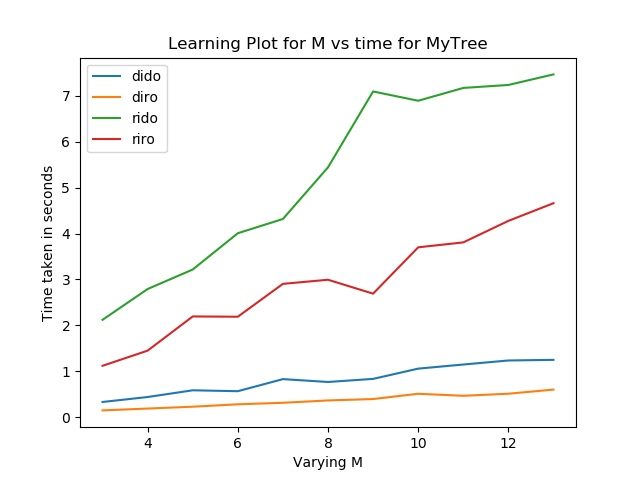
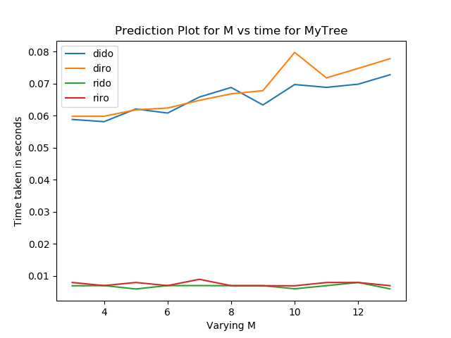
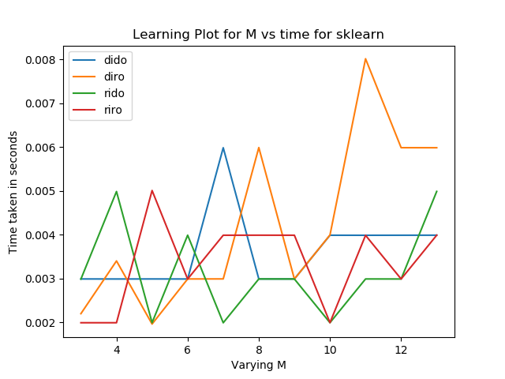
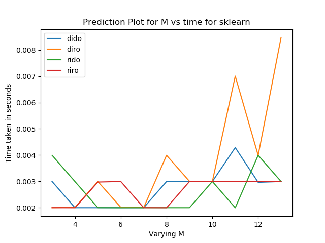
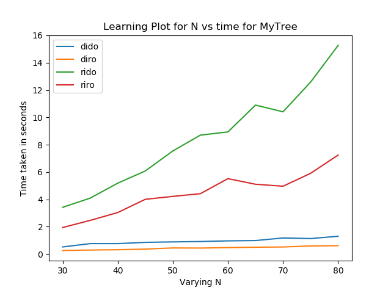
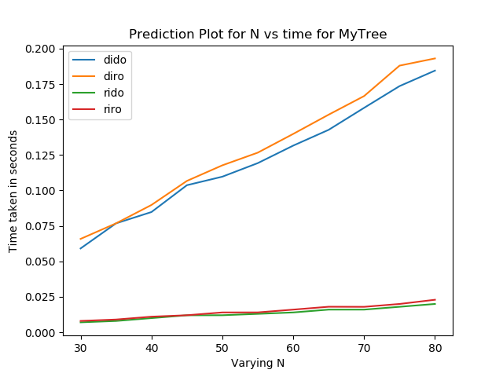
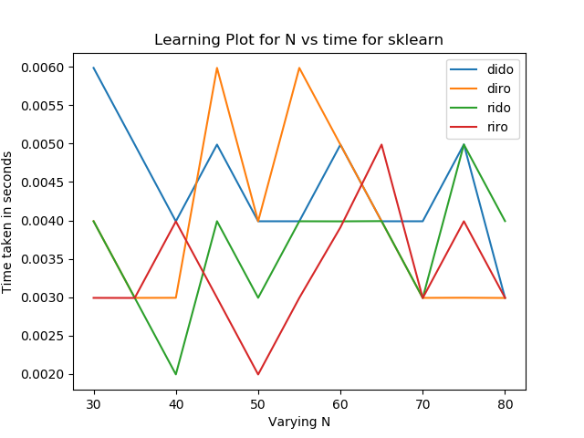
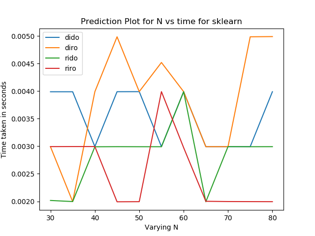

# Question Number 4 (Experimentation)

## Experimenting with decision trees

We experiment with our custom created [decision tree](\tree\base.py).

### Experiment 1 (Varying M)

In this experiment we keep the N as constant, where N are the number of samples we train our tree on. and we vary M, where M are the number of attributes.

For our decision tree, we obtain the following plots:

### Our Trees (Varying M)

#### Learning (Varying M)

  

#### Prediction (Varying M)

  

### For Sklearn (Varying M)

#### Learning (Varying M)

  

#### Prediction (Varying M)

  

### Discusion

- For the learning plots, we observe a linear increase in time for our decision tree. This is comparable to the theoritical time complexity of decision tree. This is observed as the more are the number of columns the more time it takes to calculate the optimum column to select the split.
- We also observe that riro and rido curves take more time than diro and dido curves. This is because for real input we have to check the optimum split for all rows in the column. While in case of discrete inputs, we can directly calculate the split by clubing similiar labels.
- Sklearn is well optimised and thus doesnt break a sweat for such small data as ours and thus shows a constant time. For sklearn bigger datasets might actually show differences.

### Experiment 2 (Varying N)

In this experiment we keep M as constant, where M are the number of attributes on which we train our tree. and we vary N, where N are the number of samples.

For our decision tree, we obtain the following plots:

### Our Trees (Varying N)

#### Learning (Varying N)

  

#### Prediction (Varying N)

  

### For Sklearn (Varying N)

#### Learning (Varying N)

  

#### Prediction (Varying N)

  

### Discusion (Varying N)

- For the learning plots, we observe a quadratic increase in time for our decision tree. The theoritical time complexity is O(nlogn). We go through each and every split in our tree which increases its time complexity. Thus our results could be better if we select the best split more effeciently.
- We also observe that riro and rido curves take more time than diro and3n directly calculate the split by clubing similiar labels.
- Sklearn is well optimised and thus doesnt break a sweat for such small data as ours and thus shows a constant time. For sklearn bigger datasets might actually show differences.
