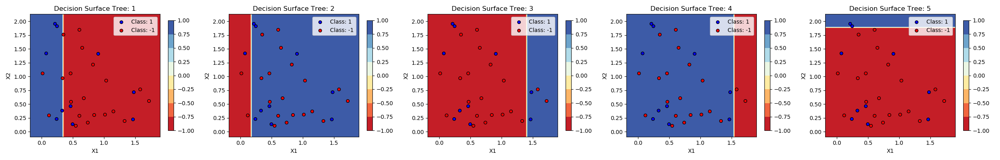
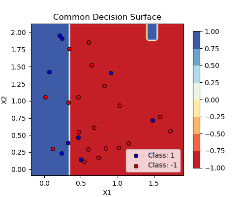
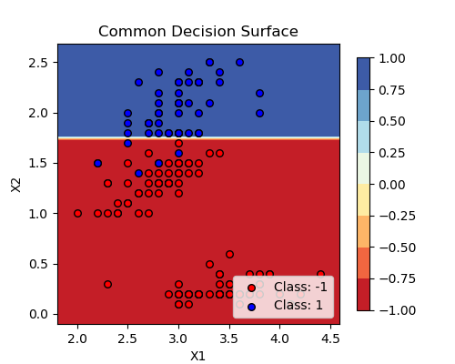

# Question Number 5 (Adaboost)

## Various Plots for synthetic data

### Plots for n estimators

  

### Common Decision Boundary

  

## Various Plots on Iris Dataset

### 3 estimators on Iris Dataset

Here, -1 = Not Virginica and 1 = Virginica

  

### Common Decision Boundary

Here, -1 = Not Virginica and 1 = Virginica

  

